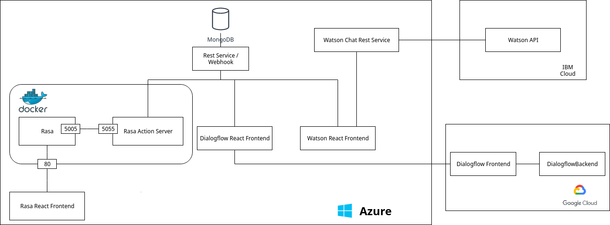
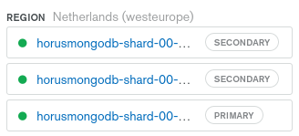

# CLC3 - Project Documentation
- Type A - Architecture

## Team
- Oscar Ablinger
- Gerald Spenlingwimmer

## Relation to CLC3
Cloud deployment with Azure.
Usage of the cloud services "IBM Watson Assistant" and "Dialogflow".
Development of a cloud endpoint for Rasa.
Creation of a cloud architecture for data processing of chatbots.
Full stack app (MongoDB <--> REST <--> Frontend) in the cloud. 

## Problem Description
Out in the real world there are still lots of problems/tasks which can be automated.
On such task is e.g. a sickness notification or holiday notifications. To solve this problem in a creative way, to automate the process and increase user acceptance chatbots are used. 
To be able to make people test the actual application for real in a convenient way the cloud is a wonderful solution since then the application can be tested by anyone everywhere at any given time by clicking a link. To achieve this Azure was used for prototyping. Furthermore, the differences and similarities of such frameworks are intersting from a development and end-user view. To create an overview of similiarities and differences the three frameworks "Rasa", "Dialogflow" and "IBM Watson Assistant" are used. One important factor is that Rasa is actually open source and free of charge and not a cloud framework. So additionally a non cloud framework competes against cloud only frameworks. The focus for the CLC project remains the architecture with a live demo. The expected result is that all three frameworks are processed in a similar fashion.

## Methodology


## Architecture

The architecture can be categorized into four different parts:

1. The data backend (MongoDB + REST Service),
2. the Rasa implementation,
3. the Dialogflow implementation and
4. the Watson implementation.

Both Rasa's and Watson's implementation consist of a front and a
backend; only Dialogflow's backend did not require an additional
implementation.

The below diagram shows how the different points are connected with each other.



### The data backend

All chatbot implementations use the same data from the MongoDB
backend.
The MongoDB documents are hoted via MongoDB.Atlas in Azure.
By default they consist of three shards, that are automatically
managed.

The only interaction with that database is over its REST service, whose
implementation can be found in the `/resteasy` folder.
The service itself is, again, hosted in Azure.

The following end points are defined:

- **GET `/`** checks whether the service is currently up
- **GET `/sick`** returns whether a user is sick
    > For example a request body
    > ```json
    > { "name": "hans wurst" }
    > ```
    > returns
    > ```json
    > [{"_id": { "$oid": "5e222d1cc565840026316b80" },
    >   "user": { "$oid": "5e222d1bc565840026316b7b" },
    >   "sickdays": [ "10.12.2019", "11.12.2019" ]
    > }]
    > ```

- **POST `/dialogflow/webhook`** and **POST `/watson/webhook`**
    are the end points for the dialogflow and watson implementations
    respectively.
    Both read the intent of the request and depending on that either
    register someone as sick or register a vacation (the later of
    which is only avaialable in the dialogflow implementation).

Additionally for testing some more end points were implemented:

- **POST `/sick`** registers a user as sick
    > For example a request body like this is expected:
    > ```json
    > { "name": "hans wurst" }
    > ```

- **GET `/sick/all`** returns all sick users
    > For example it could return the following data set:
    > ```json
    > { "gerald wimmer": [ "20.01.2020" ],
    >   "hans wurst": [ "10.12.2019", "11.12.2019", "20.01.2020" ]}
    > ```

- **GET `/vacation/all`** returns all registered vacations
    > For example it could return the following data set:
    > ```json
    > [{"end": "Fri, 03 Apr 2020 10:00:00 GMT",
    >   "start": "Wed, 01 Apr 2020 10:00:00 GMT",
    >   "user": "hans wurst"
    > }]
    > ```

- **GET `/dialogflow/requests`** and **GET `/watson/requests`** return
    the last request to the dialogflow and watson webhook respectively.

### Rasa

Since Rasa is just a framework for chatbots and doesn't offer any cloud
solution itself, it was wrapped in a docker container, which was then deployed to an Azure multi-container environment.
The images are created with the .Docker files and pushed to an Azure container registry. From there they can be pulled into the multi-container environment with a docker-compose file.
The dockerfiles and docker-compose files can be found in the folder `rasa`,
together with the actions, data, models and the domain for rasa itself.

The **Rasa Action Server** is used for custom commands, while **Rasa**
is the Core of the application that is provided by rasa docker image.
Rasa handles the whole NLP/NLU part. It is used to create and run the model and handles the whole chat. The action server is used for data validation/collection and communication with external components. 
The Rasa action server was used for the entity/data collection from the chat.
Furthermore, the action server is a backend which can validate data components and communicate with external services and takes care of the submission of the collected data to the REST service.


The frontend for rasa can be found in the folder `frontend`.
It's implemented using React.js and consists of five main components:

- _Messenger_: 
  - The main component that contains all of the other components.
  - It also manages the REST calls.
- _MessengerSubmitArea_: 
  - Chat input and submit button
  - ENTER can be used for submit
- _MessageArea_: 
  - The wrapper for all of the message cards
  - automatically scrolls to bottom when a message is received
- _MessageCard_: 
  - A card that represents a message
  - Has a sender (BOT, YOU)
  - Has a timestamp with milliseconds
    - How long does a requests take?
    - How long does the cold start take?
- _MessengerToolbar_: 
  - Purely visual component
  - Holds a heading for the messenger

The design is close to what people are used to from WhatsApp to increase acceptance. To increase usability a few features like automatically scroll to bottom on message receive and submit message when ENTER is pressed were implemented. It's also impossible to send an empty message.
Put together it looks like this:


### Dialogflow

Using Dialogflow next to no hosting has to be done outside of what it
already offers.
It is automatically integrated into the Google Cloud Platform.

The frontend that can be found in `dialogflow` is barely a react-wrapper
around an iframe that is provided by Dialogflow itself.

The models used can be found in the folder `models`.
They are shared with Watson.

### Watson

While Watson can be integrated with any Cloud Service, the most natural one
is on the IBM Cloud (as Watson itself is made by IBM).

The models for it can be found in the folder `models`.

Additionally, however, a REST-API that connects to that cloud instance, was
created.
It can be found in `watson_server` and has the following end points:

- **GET `/`** checks whether the server is online
- **GET `/watson/session`** creates a new session with the Watson
    Assistant – a class provided by the Watson framework that
    connects to the extenal Watson server on the IBM Cloud.
    > Example answer:
    > ```json
    > {"session_id":"c3d7497f-1e66-47b6-8c03-d0428135414f"}
    > ```

- **POST `/watson/send`** directs the message to the Assistant and returns its
    answer.
    > Example conversation:
    > ```json
    > { "message": "hello",
    >   "sessionId":"c3d7497f-1e66-47b6-8c03-d0428135414f" }
    > ```
    > might result in the following answer:
    > ```json
    > { "output": {
    >       "entities": [],
    >       "generic": [{
    >           "response_type": "text",
    >           "text": "Hallo, wie kann ich helfen?" }],
    >       "intents": [{
    >           "confidence": 1,
    >           "intent": "Hello" }]
    > }}

The frontend for watson is a fork of Rasa's front end and can be found in
the folder `watson_frontend`.
The structure stayed the same so refer to [it's documentation](#rasa) for
the documentation.
The only difference is that it connects to the Watson REST service instead
of Rasa's backend.

## Technologies

- **Python** as the general programming language for the servers
- **Gunicorn/Flask** to start the REST-servers
- **MongoDB** in the backend as the data-storage
- **Rasa** and the wrapper **Rasa X** as one of the model trainers
    and chatbot framework
- **Dialogflow** is another chatbot framework that was used
- **IBM Watson Assistant** as the third chatbot framework
- Chatbot
- **Azure** to host all of our own services, that weren't automatically
    integrated into another cloud provider
- **Docker** for developement and to wrap around the Rasa programs
- **Azure Multi Container Environment**
- Webhook
- Cloud Services
- **Azure WebApp**
- **React** and **Node** for the front-end developement
- **Material Design** and **Material Icons** for the styling of the front-ends

## Questions and Answers

### Automated Infrastructure Provisioning

For the size of this project automated infrastructure provisioning was
not necessary.
However, all of the services can individually and easily be scaled by requesting
more ressources from the cloud providers.
Even for the data backend MongoDB.Atlas allows a way to easily updgrade
the amount of RAM and storage that they provide.

Therefore there is not a single point in the applications that could not
be scaled up just through requesting more ressources.

### Scalability

- Chatbots
  - Rasa: is scalable itself, runs in a Docker container so it can be scaled even further if necessary
  - Dialogflow: up to 160 request per minute
  - IBM Watson Assistant: No information given but messages are unlimited, Session times out after a few minutes

- MongoDB: Atlas offers up to 140GB RAM and 4095GB storage with no
    apparent limit to transactions.

### Fail Safety/Reliability

The project depends on the cloud providers to also guarantee
reliability and restart failing services.
Restarting any service should have only minimal effects on the
entire system:
- MongoDB.Atlas automatically duplicates data, so none _should_ be lost
- The rest of the systems only store minimal session data, that
    is not intended to be permanent anyways

The free tiers that were used, of course, also affect the priority
of issues set by the providers.

### NoSQL

As data base, MongoDB was chosen.
With MongoDB Atlas, it already offers a cloud solution and hosting.
Additionally to being well suited for the cloud, it also has the
advantage of having no predefined structure.
Extending the database therefore is possible without having to
migrate (or lose) any data.

For example, the vacation functionality was added after everything else was
set up.
All of the previous data could be kept as-is and the new vacation objects
could immediately be added to the database.

### Replication

MongoDB Atlas promises to always have at least three data nodes deployed across
fault domains (or availability zones if AWS was used or zones for GCP) and
keep the data in-sync.



### Picture of the Frontend in Use


## Results
A working full stack cloud based architecture capable of storing and retrieving data from a MongoDB cluster with three shards, processing data from chats in a REST service, wrapping IBM Watson Assistant calls to bypass the CORS problem and displaying chats in frontends.
The simple use case can be done with three different frameworks in similar fashion.

## Findings
### Chatbot Frameworks
  - Similarities
    - The basics are the same
      - Utterance = sample sentences to train intents
      - Intent = task to handle
      - Entity = information to be retrieved
      - Story = dialog flow
      - Pattern = regex to define entities yourself
      - Webhook = some address to send JSON to
      - JSON: all use json for data transmission
  - Comparison
    - Rasa
      - rather complex
      - no intent inforamtion
      - fully customizable
      - live training
      - programming necessary
    - IBM Watson Assistant
      - less complex than Rasa
      - more complex than Dialogflow
      - good additional intent information
      - good customizable
      - webhook data format freely customizable
      - Confusing for beginners
      - no programming needed
      - CORS can't be enabled
    - Dialogflow
      - very easy to use
      - least customization capabilities
      - metadata request bloat
      - no programming needed
### Azure
- the portal is confusing at the beginning because there are so many possibilities
- it's rather easy to deploy React apps
- Docker containers work OK in Azure
  - I don't use docker often so this part took quite some time
  - an own Docker registry has been created in Azure to pull images from
- Availability is not that great in the free tier
  - I had no acces to all apps of one plan for 4 days so I had to cerate a new one and redeployed everything
- Deployment can sometimes take a lot of time when strange errors occur although it shouldn't be hard
- functionality is scathered around in the portal
  - e.g. Error logs or logs in general are hard to find in the beginning
  - VSCode helps with finding the logs
- If deployment is set up once it runs smooth all the time, one click and done
- It's possible to get into running Docker containers in a web shell interface which is pretty cool

### Costs

|     Description      | Costs/Month          | Type       | Capacity                      | Memory                      | Used For         |
|:--------------------:|----------------------|------------|-------------------------------|-----------------------------|------------------|
|      Linux Plan      | 70.80 - 284.41 €     | Production | 210 - 840 total Alu           | 3.5 - 14 GB                 | All Servers      |
|     Windows Plan     | 61.56 - 492.49 €     | Production | 100 total Alu - 840 total Alu | 1.75-14 GB                  | React Frontends  |
|      Dialogflow      | 0€                   | Standard   | 180 Requests / min            | -                           | Chatbot          |
| IBM Watson Assistant | $0.0025USD/ message  | Standard   | Unlimited                     | -                           | Chatbot          |
|         Rasa         | Free and Open Source | Standard   | Has to be provided yourself   | Has to be provided yourself | Chatbot          |
|    MongoDB.Atlas     | None (free tier)     | Standard   | 512 MB                        | Shared with other instances | Data persistance |
|     Total Costs      | 132.36 € +             |            |                               |                             |                  |

## Live Demo Links
- Backend
  - [Rasa Server](https://3-banken-it-nlp-server.azurewebsites.net/)
  - [Watson Service](https://3-banken-it-watson-server.azurewebsites.net/)
  - [REST Service / Webhook](https://3-banken-it-webhook.azurewebsites.net/)
- Frontend
  - [Rasa](https://3-banken-it-chatbot.azurewebsites.net/)
  - [Watson](https://3-banken-it-chatbot-watson.azurewebsites.net/)
  - [Dialogflow](https://3bitdialogflow.azurewebsites.net/)

## Github Links
- Backend
  - [Rasa Server](https://github.com/classProgrammer/horus)
  - [Watson Service](https://github.com/classProgrammer/horus_watson_server)
  - [REST Service / Webhook](https://github.com/classProgrammer/horus_RESTeasy)
- Frontend 
  - [Rasa](https://github.com/classProgrammer/horus_frontend)
  - [Watson](https://github.com/classProgrammer/horus_watson_frontend)
  - [Dialogflow](https://github.com/classProgrammer/horus_dialogflow)
