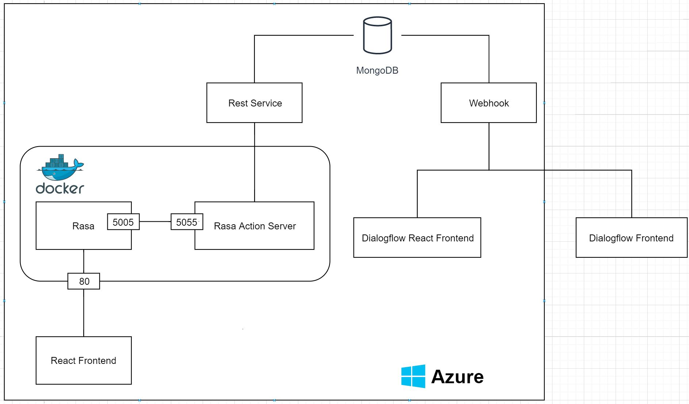
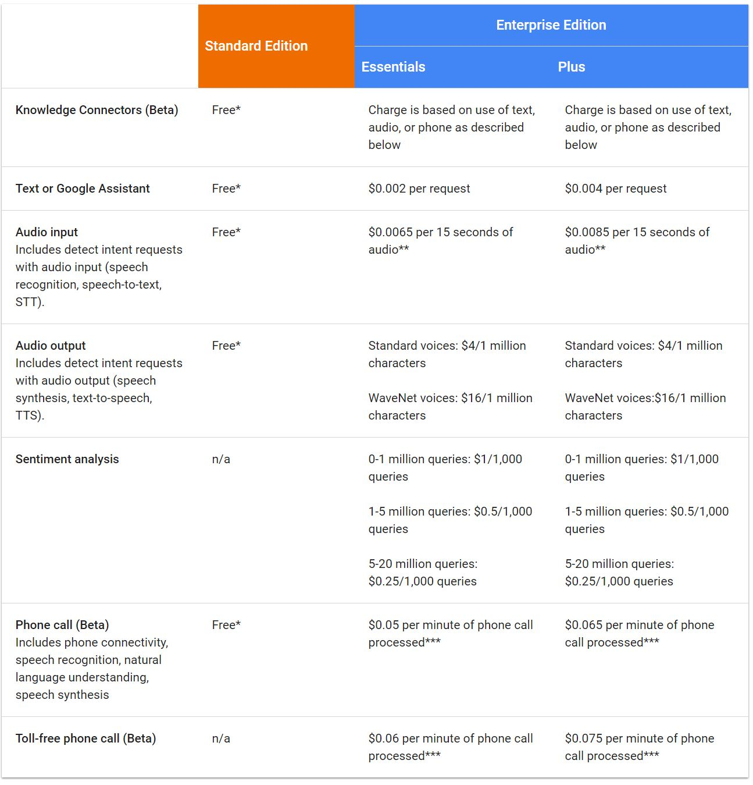
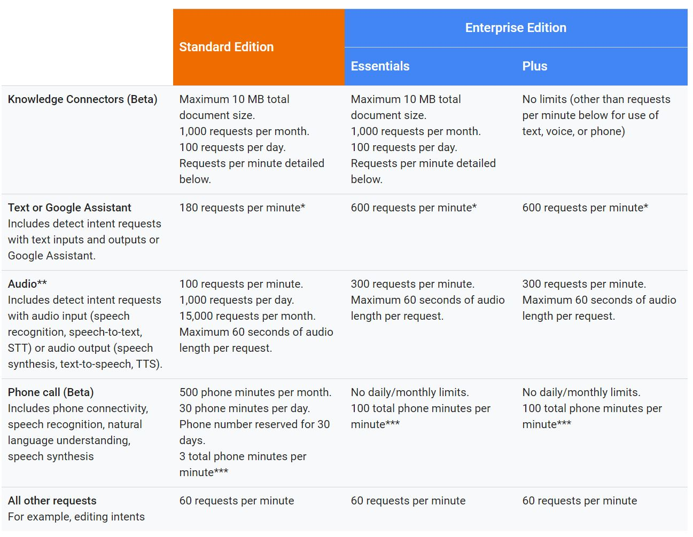

# Collection of Infos and Thoughts concerning the Chatbot Masters Thesis

## The Example Sentence Used for Concept Explanation
I want to book a room in the Four Seasons hotel in New York from the 5th January to the 12th January

## Concepts of NLP/NLU concerning Chatbots

### Intent
The reason a person says something.
In the example the reason/intention is to book a room.

### Utterance
An example sentence that is used as a base for the intents. In most cases 5-10 utterances/example sentences are sufficient for a decent result.
The example is also one such utterance.

### Entity
A piece of information wich needs to be extracted.
In the example sentence this would be 
- New York (Location)
- 05.01.2020 - 12.01.2020 (Timespan)
- Four Seasons(Location/hotel)

Predefined entities can be used e.g. in Dialogflow (datetime, date, person).
Entities can be created from scratch.

### Story
A scrip the conversation has to follow e.g.
- user> Hello
- bot>  Hello, how may I help?
- user> I am sick today
- bot>  I am sad to hear that. May I have your name to process your request?
- user> John Doe
- bot>  OK, please enter your date of birth?
- user> 12.12.2012
- bot>  Your request has been submitted sucessfully. Get well soon John Doe.
- user> Thank you
- bot>  A pleasure
- user> bye
- bot>  bye

## Planned Architecture
- DB: Database MongoDB
- Rest Service: Interface for information extraction/storage/validation for the local chatbot
- Webhook: Interface for information extraction/storage/validation for Dialogflow
- Docker Container: Hosts Rasa (Language Server) and the Rasa Action Server
- Rasa (Language Server): Model of the language the chatbot can understand
- Rasa Action Server: Hosts all actions e.g. collecting information for a form is a formAction running at this server
- React Frontend: A simple React messenger frontend communicating with the Rasa server
- Dialogflow Frontend: Provided by Dialogflow
  

## Cloud vs Local Chatbot Development

### Scalability
With Rasa you have to take care of scalability your own.
Dialogflow is scalable by default but with limits.

### Support
Google offers a cloud support plan, Rasa the enterprise edition with support.

### Needed Knowledge
To develop with Dialogflow only basic knowledge of Intents, Entities and Utterances is needed.
To develop with Rasa additionally the setup needs to be done and Stories are important.

### Complecity of Project
The Rasa project is far more complex and harder to understand. Dialogflow can be used by almost anybody to create a chatbot.

### Complexity of Development
Rasa is far more complex for developers.

### Price
Rasa is open source and free of charge but offers an enterprise edition.
Dialogflow is free of charge for small projects but costs something when more requests per minute are required.

### Customization
Rasa offers far more options to customize the chatbot and communicate with other services for e.g. validation.

### Deployment
Dialogflow already runs in the cloud and there is no need to deploy it somewhere else.
Rasa needs to be deployed.

### Precision of Intents
Good enough in both cases

### Resonse Times
No mentionable difference here

### Predefined Types
Dialogflow has a lot of good predefiend types.
Rasa offers none.

### Training Options
Dialoflow offers no options.
Rasa can be trained live with reinforcement learning which makes the development of large/complex conversations easier.

### Project Setup Complexity
Dialogflow does not need setup.
Rasa needs to be installed or started in a docker container.

### Exception/Error Handling
Rasa is far better here.

### Change Technologie
Rasa can import a Dialogflow file.
Dialogflow can't import Rasa.

### Usability for Developers
Dialogflow wins this one by far.

### Usability End Result/Frontend
Comparable in both cases.

## Dialogflow Concepts
Intent, Entity, Utterance

## Rasa Concepts
Intent, Entity, Utterance, Stories

## Dependence
With Dialogflow one is dependent on Google, a company which loves to drop projects.
With Rasa one is independent from other companies but still dependent on the framework.

## Plan
- Discuss Architecture
- Discuss Communication
- Discuss Concepts
- Discuss Conversational Flow
- Next Steps
- What to write about in the Thesis (Implementation, Comparison)
- Show from developer view
- hosting
- do you have docker available?
- What's better Dialogflow or Rasa
- My Next Steps (Expose, Master Thesis)
- Details on what the chatbots can do (e.g. abort)
- Which contents are interesting for the "3 Banken IT"
- Authentication with chatbot impossible
- Other use cases?
- When is the prototype finished for you?
- Handle phone calls (store data in database, retrieve on PC with key)
- Security when replacing phone conversation with text based input (Authentication problematic)